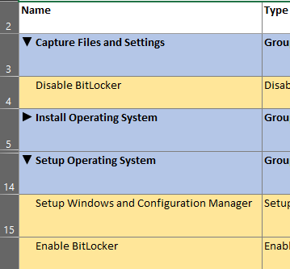
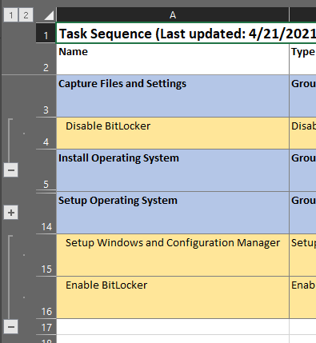

# Export-TSToExcel
PowerShell function that exports a Configuration Manager task sequence to an
Excel sheet for documentation


The generated Excel sheet should be easy to read and navigate. Additional
options are available to expand/collapse groups with macro-enabled buttons,
which is good for nested task sequences.

## Requirements
* Powershell (tested on 5.1)
* Microsoft Excel (tested on 2019)
* Microsoft Endpoint Configuration Manager Console
* Ability to run unsigned scripts on your system

## Usage
This shows you how to generate a simple Excel sheet by accessing the task
sequence in a PowerShell session opened in the admin console. See More Examples
for additional uses.

First, launch PowerShell from the admin console:


This script is unsigned, so you may need to temporarily change the execution
policy to allow it.
```powershell
PS> Set-ExecutionPolicy -Scope Process -ExecutionPolicy Unrestricted
```

Dot source the script:
```powershell
PS> . C:\Path\To\TSToExcel.ps1
```

Get the task sequence and pipe it through Export-TSToExcel:
```powershell
PS> Get-CMTaskSequence -Name "Task Sequence" | Export-TSToExcel -Show
```

That's it! A progress bar should be visible in the PowerShell window and Excel
should appear when it's finished.

## Syntax
```powershell
Export-TSToExcel -Xml <XmlDocument> [-ExportPath <FileInfo>] [-TSName <String>] [-Show] [-Macro] [-Outline] [-HideProgress] [<CommonParameters>]

Export-TSToExcel -XmlPath <FileInfo> [-ExportPath <FileInfo>] [-TSName <String>] [-Show] [-Macro] [-Outline] [-HideProgress] [<CommonParameters>]

Export-TSToExcel -TaskSequence <Object> [-ExportPath <FileInfo>] [-Show] [-Macro] [-Outline] [-HideProgress] [<CommonParameters>]
```

## Parameters
### `-TaskSequence <Object>`
A task sequence object obtained from the `Get-CMTaskSequence` cmdlet. This is
also accepted as a pipeline.

### `-Xml <XmlDocument>`
The task sequence steps as a string or XML object. This can be obtained from
the `Sequence` property of a task sequence object.

### `-XmlPath <FileInfo>`
The file path to a task sequence XML file.

### `ExportPath <FileInfo>`
The path to save the Excel file. This must end in `.xlsx`, or `.xlsm` for
macro-enabled files. If this is omitted, Excel will be shown after the sheet is
generated so you can save it manually.

### `-TSName <String>`
The name of the task sequence that's displayed at the top of the Excel sheet.
This is obtained automatically from the `-TaskSequence` parameter, and should
be omitted if that's used. Otherwise, this will default to "Task Sequence" if
omitted.

### `-Show`
Shows Excel after the sheet is generated.

### `-Macro`
Includes macro buttons to expand/collapse groups. See the example for more
info.

### `-Outline`
Groups (outlines) rows in the Excel sheet so they can be expanded/collapsed
without the use of macro buttons.

### `-HideProgress`
Hides the progress bar in the PowerShell window.

## More Examples
Generate an Excel sheet from a task sequence object (without using the
pipeline), save it to the given path, and show it:
```powershell
$ts = Get-CMTaskSequence -Name "Task Sequence"
Export-TSToExcel -TaskSequence $ts -ExportPath C:\ts.xlsx -Show
```

----------------------

Generate an Excel sheet from task sequence XML data with macro buttons, save
it, and show it:
```powershell
$sequence = (Get-CMTaskSequence -Name "Task Sequence").Sequence  # XML string
Export-TSToExcel -Xml $sequence -TSName "Task Sequence" -Macro -ExportPath C:\ts.xlsm -Show
```

Arrow buttons appear next to the group names. Clicking them will hide or show
the contents of that group.



The workbook must be saved as a macro-enabled file, ending in the `.xlsm`
extension. Using `.xlsx` will result in an error.

This also requires access to the VBA object model. If access is not allowed
(which is the default behavior), the script will prompt if it's okay to change
a registry setting to allow access. You can also set this manually in Excel by
navigating to File > Options > Trust Center > Trust Center Settings... > Macro
Settings, and checking "Trust access to the VBA project object model". **This
will allow scripts and programs to modify and run macro scripts in Excel. Use
wisely.**

----------------------

Generate an Excel sheet from a task sequence XML file with outlined groups,
save it, and don't show the progress bar:
```powershell
(Get-CMTaskSequence -Name "Task Sequence").Sequence | Out-File C:\ts.xml
Export-TSToExcel -XmlPath C:\ts.xml -TSName "Task Sequence" -Outline -ExportPath C:\ts.xlsx -HideProgress
```

Outline groups in Excel can expand/collapse grouped rows.



They're less intuitive than the macro buttons, but don't require any special
security permissions.