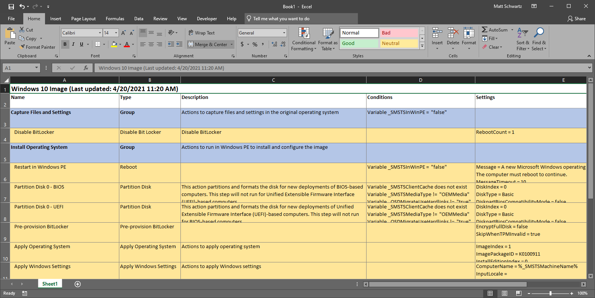
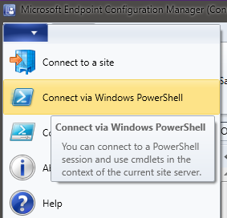

# Export-TSToExcel
PowerShell function that exports a Configuration Manager task sequence to an
Excel sheet for documentation



The generated Excel sheet should be easy to read and navigate. Additional
options are available to expand/collapse groups with macro-enabled buttons,
which is good for nested task sequences.

## Requirements
* Powershell (tested on 5.1)
* Microsoft Excel (tested on 2019)
* Microsoft Endpoint Configuration Manager Console
* Ability to run unsigned scripts on your system

## Usage
This shows you how to generate a simple Excel sheet by accessing the task
sequence in a PowerShell session opened in the admin console. See More Examples
for additional uses.

First, launch PowerShell from the admin console:



This script is unsigned, so you may need to temporarily change the execution
policy to allow it.
```powershell
PS> Set-ExecutionPolicy -Scope Process -ExecutionPolicy Unrestricted
```

Dot source the script:
```powershell
PS> . C:\Path\To\TSToExcel.ps1
```

Get the task sequence and pipe it through Export-TSToExcel:
```powershell
PS> Get-CMTaskSequence -Name "Task Sequence" | Export-TSToExcel -Show
```

That's it! A progress bar should be visible in the PowerShell window and Excel
should appear when it's finished.

## More Examples
Generate an Excel sheet from a task sequence object (without using the
pipeline), save it to the given path, and show it:
```powershell
$ts = Get-CMTaskSequence -Name "Task Sequence"
Export-TSToExcel -TaskSequence $ts -ExportPath C:\ts.xlsx -Show
```

Generate an Excel sheet from task sequence XML data with macro buttons, save
it, and show it:
```powershell
$sequence = (Get-CMTaskSequence -Name "Task Sequence").Sequence  # XML string
Export-TSToExcel -Xml $sequence -Name "Task Sequence" -Macro -ExportPath C:\ts.xlsm -Show
```

Generate an Excel sheet from a task sequence XML file with outlined groups,
save it, and don't show the progress bar:
```powershell
(Get-CMTaskSequence -Name "Task Sequence").Sequence | Out-File C:\ts.xml
Export-TSToExcel -XmlPath C:\ts.xml -Name "Task Sequence" -Outline -ExportPath C:\ts.xlsx -HideProgress
```